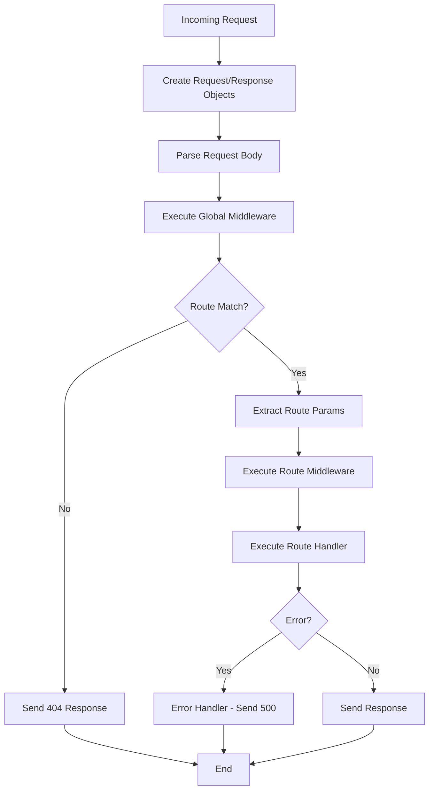

# Design Document: Node.js Backend Framework MVP

## Overview

The Node.js backend framework is a lightweight, Express-like HTTP framework built on top of Node.js's native `http` module. It provides an intuitive API for building RESTful services with routing, middleware, request/response handling, and error management. The framework follows a modular architecture with clear separation of concerns.

### Core Design Principles

- **Simplicity**: Minimal API surface with intuitive method names
- **Pragmatic Dependencies**: Use well-tested libraries where appropriate to avoid reinventing the wheel
- **Extensibility**: Middleware pattern allows easy extension
- **Performance**: Lightweight with minimal overhead
- **Developer Experience**: Chainable API and helpful error messages
- **Installable**: Distributed as an npm package for easy integration

## Architecture

The framework follows a layered architecture:

```
┌─────────────────────────────────────┐
│     Application Layer (App)         │
│  - Route registration               │
│  - Middleware registration          │
│  - Server lifecycle                 │
└──────────────┬──────────────────────┘
               │
┌──────────────▼──────────────────────┐
│      Router Layer                   │
│  - Route matching                   │
│  - Parameter extraction             │
│  - Route groups                     │
└──────────────┬──────────────────────┘
               │
┌──────────────▼──────────────────────┐
│   Request/Response Layer            │
│  - Request parsing                  │
│  - Response formatting              │
│  - Body parsing                     │
└──────────────┬──────────────────────┘
               │
┌──────────────▼──────────────────────┐
│      Node.js HTTP Module            │
└─────────────────────────────────────┘
```

## Components and Interfaces

### 1. Application (App)

The main entry point and orchestrator of the framework.

**Responsibilities:**

- Create and manage HTTP server
- Register routes and middleware
- Coordinate request handling pipeline
- Manage route groups

**Key Methods:**

```javascript
class App {
  constructor(options = {})

  // HTTP method handlers
  get(path, ...handlers)
  post(path, ...handlers)
  put(path, ...handlers)
  delete(path, ...handlers)
  patch(path, ...handlers)

  // Middleware
  use(pathOrMiddleware, middleware)

  // Route groups
  group(prefix, callback)

  // Server lifecycle
  listen(port, callback)

  // Internal
  _handleRequest(req, res)
  _executeMiddleware(req, res, middlewareStack, finalHandler)
}
```

### 2. Router

Handles route registration, matching, and parameter extraction.

**Responsibilities:**

- Store routes with their handlers
- Match incoming requests to registered routes
- Extract route parameters from URLs
- Support route grouping with prefixes

**Key Methods:**

```javascript
class Router {
  constructor()

  addRoute(method, path, handlers)
  match(method, path)

  // Internal
  _pathToRegex(path)
  _extractParams(path, matches)
}
```

**Route Storage Structure:**

```javascript
{
  method: 'GET',
  path: '/users/:id',
  regex: /^\/users\/([^\/]+)$/,
  paramNames: ['id'],
  handlers: [handler1, handler2],
  middleware: [middleware1]
}
```

### 3. Request

Enhanced wrapper around Node.js IncomingMessage.

**Responsibilities:**

- Parse query strings
- Parse JSON body
- Provide easy access to headers, params, and URL components

**Properties:**

```javascript
class Request {
  constructor(req)

  // Properties
  method      // HTTP method
  url         // Full URL
  path        // URL path
  query       // Parsed query parameters
  params      // Route parameters
  headers     // Request headers
  body        // Parsed body (async)

  // Internal
  async _parseBody()
}
```

### 4. Response

Enhanced wrapper around Node.js ServerResponse.

**Responsibilities:**

- Send JSON responses
- Send text responses
- Set status codes and headers
- Manage response lifecycle

**Key Methods:**

```javascript
class Response {
  constructor(res)

  status(code)           // Set status code (chainable)
  json(data)             // Send JSON response
  send(data)             // Send text/html response
  setHeader(key, value)  // Set response header (chainable)
  end()                  // End response

  // Internal
  _sent                  // Track if response was sent
}
```

### 5. Middleware System

Middleware functions follow the signature: `(req, res, next) => void`

**Execution Flow:**

```
Request → Middleware 1 → Middleware 2 → ... → Route Handler → Response
                ↓              ↓                      ↓
            next()         next()              (no next call)
```

**Built-in Middleware:**

- Body parser (JSON)
- Error handler (implicit)

## Data Models

### Route Definition

```javascript
{
  method: String,        // 'GET', 'POST', etc.
  path: String,          // Original path pattern
  regex: RegExp,         // Compiled regex for matching
  paramNames: String[],  // Extracted parameter names
  handlers: Function[],  // Handler functions
  middleware: Function[] // Route-specific middleware
}
```

### Request Context

```javascript
{
  method: String,
  url: String,
  path: String,
  query: Object,
  params: Object,
  headers: Object,
  body: Object | null
}
```

### Response Context

```javascript
{
  statusCode: Number,
  headers: Object,
  body: String | Buffer,
  _sent: Boolean
}
```

## Error Handling

### Error Handling Strategy

1. **Route Not Found (404)**

   - Detected when no route matches the request
   - Automatic 404 response with JSON error message

2. **Handler Errors (500)**

   - Caught using try-catch in async handlers
   - Logged to console with stack trace
   - Generic 500 response sent to client

3. **Body Parsing Errors**
   - Invalid JSON returns 400 Bad Request
   - Error message indicates parsing failure

### Error Response Format

```javascript
{
  error: String,        // Error message
  status: Number,       // HTTP status code
  path: String,         // Request path
  method: String        // HTTP method
}
```

### Error Handler Implementation

```javascript
// Wrap all handlers in error boundary
async function safeHandler(handler, req, res) {
  try {
    await handler(req, res);
  } catch (error) {
    console.error("Handler error:", error);
    if (!res._sent) {
      res.status(500).json({
        error: "Internal Server Error",
        message: error.message,
      });
    }
  }
}
```

## Request Processing Flow



## Route Matching Algorithm

1. **Normalize Path**: Remove trailing slashes, handle empty paths
2. **Convert to Regex**: Transform route pattern to regex
   - `:param` → `([^/]+)` (capture group)
   - Static segments → literal match
3. **Test Match**: Apply regex to request path
4. **Extract Params**: Map capture groups to parameter names
5. **Return Match**: Return route definition with extracted params

**Example:**

```
Pattern: /users/:id/posts/:postId
Regex:   ^/users/([^/]+)/posts/([^/]+)$
URL:     /users/123/posts/456
Params:  { id: '123', postId: '456' }
```

## Route Groups

Route groups allow organizing routes with common prefixes and middleware.

**Implementation:**

```javascript
app.group("/api", (api) => {
  api.use(authMiddleware);

  api.group("/users", (users) => {
    users.get("/", getAllUsers); // /api/users
    users.get("/:id", getUser); // /api/users/:id
  });

  api.group("/posts", (posts) => {
    posts.get("/", getAllPosts); // /api/posts
  });
});
```

**Group Context:**

- Maintains prefix stack
- Inherits parent middleware
- Creates scoped router instance

## Testing Strategy

### Unit Tests

Test individual components in isolation:

1. **Router Tests**

   - Route registration
   - Path to regex conversion
   - Parameter extraction
   - Route matching logic

2. **Request Tests**

   - Query string parsing
   - Body parsing (JSON)
   - Header access

3. **Response Tests**
   - Status code setting
   - JSON serialization
   - Header setting
   - Response chaining

### Integration Tests

Test component interactions:

1. **Request Flow Tests**

   - Full request/response cycle
   - Middleware execution order
   - Route handler invocation

2. **Error Handling Tests**

   - 404 responses
   - 500 error handling
   - Body parsing errors

3. **Route Group Tests**
   - Prefix application
   - Middleware inheritance
   - Nested groups

### Example Test Structure

```javascript
// Test using Node.js built-in test runner or simple assertions
describe("Router", () => {
  test("should match simple routes", () => {
    const router = new Router();
    router.addRoute("GET", "/users", handler);
    const match = router.match("GET", "/users");
    assert(match !== null);
  });

  test("should extract route parameters", () => {
    const router = new Router();
    router.addRoute("GET", "/users/:id", handler);
    const match = router.match("GET", "/users/123");
    assert.equal(match.params.id, "123");
  });
});
```

## File Structure

```
framework/
├── src/
│   ├── app.js           # Main Application class
│   ├── router.js        # Router class
│   ├── request.js       # Request wrapper
│   ├── response.js      # Response wrapper
│   ├── middleware.js    # Built-in middleware
│   └── index.js         # Public API exports
├── examples/
│   └── basic-server.js  # Example usage
├── package.json         # npm package configuration
├── .npmignore           # Files to exclude from npm package
└── README.md            # Package documentation
```

## Package Configuration

The framework will be distributed as an npm package with:

- **Package name**: A unique, descriptive name (e.g., `@yourorg/framework`)
- **Main entry point**: `src/index.js`
- **Version**: Semantic versioning (start with 0.1.0 for MVP)
- **Dependencies**: Minimal, well-maintained libraries where beneficial
  - Body parsing: Consider using `body-parser` or similar for robust JSON/form parsing
  - Path matching: Could use `path-to-regexp` for advanced route patterns
- **Peer dependencies**: Node.js version requirement (e.g., >= 14.0.0)
- **License**: Open source license (e.g., MIT)

## Public API

```javascript
// Install: npm install @yourorg/framework

// Main export
const framework = require("@yourorg/framework");

// Create app
const app = framework();

// Register routes
app.get("/path", handler);
app.post("/path", handler);
app.put("/path", handler);
app.delete("/path", handler);
app.patch("/path", handler);

// Middleware
app.use(middleware);
app.use("/path", middleware);

// Groups
app.group("/prefix", (group) => {
  group.get("/path", handler);
});

// Start server
app.listen(3000, () => {
  console.log("Server running on port 3000");
});
```

## Performance Considerations

1. **Route Matching**: Use regex compilation at registration time, not per-request
2. **Body Parsing**: Only parse body when needed (lazy loading)
3. **Middleware Chain**: Use array iteration instead of recursion for better performance
4. **Object Creation**: Reuse Request/Response wrappers where possible
5. **Error Handling**: Minimize try-catch overhead by wrapping only handler execution

## Future Enhancements (Out of MVP Scope)

- Static file serving
- Template engine support
- Cookie parsing
- Session management
- CORS middleware
- Rate limiting
- Request validation
- WebSocket support
- Clustering support
